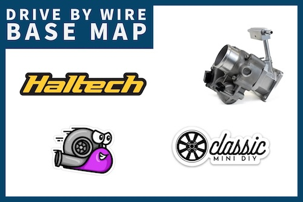

# Classic Mini ECU Maps

> **Read the [Disclaimer](#disclaimer) before using any file in this repo.**

## Base Maps

This repository is the public record of base ECU tuning maps for my drive-by-wire turbocharged Classic Mini, plus a handful of starter maps for other Classic Mini setups across multiple ECU platforms. Treat them as a **starting point** for your own tuning — not a finished product.

These maps are **NOT PLUG AND PLAY**. Every map will need to be configured for your specific vehicle and validated on a dyno before any meaningful driving. Using a map without proper tuning can cause catastrophic engine failure.

> While the maps here are free, if they save you time and you'd like to support the work, paid copies are at https://store.classicminidiy.com/collections/efi-base-maps

---

## Repository structure

### ECU platform directories
- **`haltech/`** — Haltech ECU maps and configurations
  - `R3/` — Nexus R3 (current main platform; `5-port/`, `16v/`, `dyno-reference-maps/`, `all-logs/`, `reference-maps/`)
  - `E550/`, `E750/` — Elite 550 / 750 maps
  - `E1500/`, `E1000/` — Elite 1500 / 1000 reference maps (collaborator drafts)
  - `sensor-scales/` — sensor calibration data (coolant, injectors, MAP, oil, air-temp)
  - `wiring-diagrams/` — ECU/DBW/fueling/gauge/ignition reference diagrams + the D400-to-Haltech pinout spreadsheet
- **`speeduino-megasquirt/`** — Open-source ECU platform maps (`.msq`)
- **`emerald/`** — Emerald ECU configurations (`.map`)
- **`dtafast/`** — DTA Fast ignition-only configurations
- **`ecumaster/`** — ECUMaster EMU Pro config (work in progress)
- **`maxxecu/`** — MaxxECU config (work in progress)
- **`megajolt/`** — MegaJolt ignition system configuration

### Technical documentation
- **`diagrams/`** — Wiring diagrams generated from YAML via [WireViz](https://github.com/wireviz/WireViz). Each component folder contains the `.yml` source plus the rendered `.svg` / `.png` / `.html` / `.bom.tsv`.
  - `dbw-pedal/` — Drive-by-wire pedal connections
  - `dbw-throttle/` — Drive-by-wire throttle body connections
  - `tps/` — Throttle position sensor wiring
  - `trigger-sensor/` — Engine position sensor connections

### Current feature support
| Feature             | Haltech | Speeduino | MegaSquirt | Emerald  | ECUMaster | MaxxECU | DTAFast | MegaJolt |
|---------------------|---------|-----------|------------|----------|-----------|---------|---------|----------|
| Ignition Map        |    ✅    |     ✅     |      ✅     |    ✅     |  started  | started |    ✅    |     ✅    |
| Fuel Map            |    ✅    |     ✅     |      ✅     |    ✅     |  started  | started |   _N/A_ |    _N/A_ |
| VE Table            |    ✅    |     ✅     |      ✅     |   _N/A_   |    ---    |   ---   |   _N/A_ |    _N/A_ |
| Target AFR          |    ✅    |     ✅     |      ✅     |    ✅     |    ---    |   ---   |    ✅    |     ✅    |
| Throttle Enrichment |    ✅    |     ❌     |      ❌     |   _N/A_   |    ---    |   ---   |   _N/A_ |    _N/A_ |
| Drive by Wire Ready |    ✅    |     ❌     |      ❌     |   _N/A_   |    ---    |   ---   |   _N/A_ |    _N/A_ |
| Boost Control Map   |    ✅    |     ❌     |      ❌     |   _N/A_   |    ---    |   ---   |   _N/A_ |    _N/A_ |
| Idle Map            |    ✅    |     ❌     |      ❌     |    ❌     |    ---    |   ---   |   _N/A_ |    _N/A_ |
| 16V Engine Version  |    ✅    |     ✅     |      ✅     |  **WIP**  |    ---    |   ---   | **WIP** |  **WIP** |

`started` = a base file is checked in but not yet validated. `WIP` = actively in progress.

### File types
| Extension                                               | Software / Purpose                                              |
|---------------------------------------------------------|-----------------------------------------------------------------|
| `.nexmap` (with `.nexR3-*`, `.e1500-*`, `.e1000-*`)     | Haltech NSP / ESP — Nexus R3, Elite 1500, Elite 1000            |
| `.htc` and Elite-versioned `.e550-*`, `.e750-*` nexmaps | Haltech ECU Manager / NSP — Elite 550 / 750                     |
| `.msq`                                                  | TunerStudio (Speeduino / MegaSquirt) — XML-based                |
| `.map`                                                  | Emerald EMU / DTAFast configurator                              |
| `.emupro`                                               | ECUMaster EMU Pro                                               |
| `.MaxxECU-save`                                         | MaxxECU                                                         |
| `.mjlj`                                                 | MegaJolt Lite Jr. ignition configurator                         |
| `.cal`                                                  | Haltech sensor calibration table                                |
| `.hlgzip`                                               | Haltech compressed PC log archive                               |
| `.csv` (under `haltech/R3/all-logs/`)                   | Human-readable PC log export                                    |
| `.yml` (under `diagrams/`)                              | [WireViz](https://github.com/wireviz/WireViz) diagram source    |

Log files (`.csv`, `.hlgzip`, `.zip`) under `haltech/R3/all-logs/` are tracked via [Git LFS](https://git-lfs.com). Make sure `git lfs` is installed before cloning, or you'll only get pointer files.

---
### Disclaimer

Please note that this is an example of the ECU map that works for my specific configuration and is not intended to be used as a general purpose Turbo ECU map. **Using this map on a different vehicle may result in unexpected behavior and can cause catastrophic failure.** When using this map, you are responsible for ensuring that the ECU map is configured correctly for your vehicle and it is strongly recommended you bring your car to a dyno or rolling road to ensure proper operation.

Classic Mini DIY assumes no liability for property damage or injury incurred as a result of any of the information contained in this ECU Map.  Classic Mini DIY recommends safe practices when working with power tools, automotive lifts, lifting tools, jack stands, electrical equipment, blunt instruments, chemicals, lubricants, expensive electronics, or any other tools or equipment seen or implied in this ECU Map.  Due to factors beyond the control of Classic Mini DIY, no information contained in this ECU Map shall create any express or implied warranty or guarantee of any particular result.  Any injury, damage, or loss that may result from improper use of these tools, equipment, or the information contained in this ECU Map is the sole responsibility of the user and not Classic Mini DIY. Only attempt your own repairs if you can accept personal responsibility for the results, whether they are good or bad.
